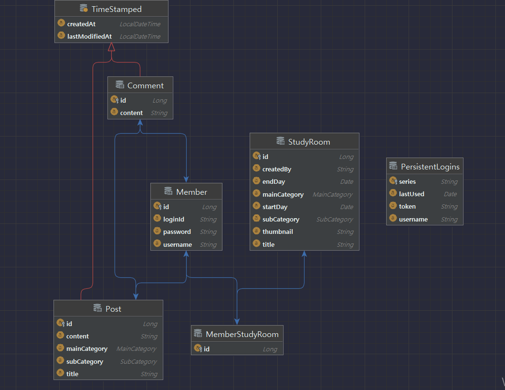

## Let's Gongbu

---

공부하다가 모르는 내용은 게시판에 올리고, 서로 댓글로 소통하거나 스터디룸의 채팅 기능을 통해 소통할 수 있습니다. 
상용화하기 위한 서비스를 제작했다기보다는, 지금까지 학습한 자바와 스프링에 대한 이해를 조금 더 심도있게 가져가고자 진행한 1인 프로젝트입니다.

## 참여인원

---

1인 프로젝트이기 때문에 혼자서 진행했습니다. 
부족한 점이 많지만, 적용한 내용은 정확한 동작방식을 이해한 후 적용한 것이며 남에게 설명할 수 있을 정도로 이해하지 못한 것은 '보류'로 남겨놓은 것도 있습니다. 
끊임없이 공부하며, 보류로 남겨놓은 것들도 빠른 시일내에 완성하고 싶은 욕심입니다.

## 프로젝트 기간

---

2022.07.03 ~ 2022.08.09

## 기술스택

---

 
   
   
  
   
  
  
   
  
  
  
   

## ERD

---

## 문제 해결 과정

1. [웹소켓에서 유저 정보를 가져오려면?](https://velog.io/@mindfulness_22/websocket-userinfo)
2. [특정 기능에만 로그를 찍고 싶어! 그럼 어떻게 하지? 답은 AOP!](https://velog.io/@mindfulness_22/%ED%8A%B9%EC%A0%95-%EA%B8%B0%EB%8A%A5%EC%97%90%EB%A7%8C-%EB%A1%9C%EA%B7%B8%EB%A5%BC-%EC%B0%8D%EA%B3%A0-%EC%8B%B6%EC%96%B4-%EA%B7%B8%EB%9F%BC-%EC%96%B4%EB%96%BB%EA%B2%8C-%ED%95%98%EC%A7%80-%EB%8B%B5%EC%9D%80-AOP)
3. [로그 출력 방식, 콘솔과 파일 둘다 관리해주세요!](https://velog.io/@mindfulness_22/series/Logging)
4. [통합 테스트 말고 단위 테스트만 하고 싶으면 어떻게 하죠?](https://velog.io/@mindfulness_22/unit-test-code-first-experience)
5. [자동 로그인 기능 구현 with remember me](https://velog.io/@mindfulness_22/%EC%9E%90%EB%8F%99-%EB%A1%9C%EA%B7%B8%EC%9D%B8-%EA%B8%B0%EB%8A%A5-%EA%B5%AC%ED%98%84-with-remember-me)
6. [우리 서비스가 글로벌 서비스가 된다면? 메세지와 국제화를 적용해보자!](https://velog.io/@mindfulness_22/spring-message)
7. [FE없이 SSR, 좌충우돌 Thymeleaf 사용기](https://velog.io/@mindfulness_22/thymeleaf)
8. [N:M 다대다 관계 매핑, 어떻게 풀어낼 것인가?](https://velog.io/@mindfulness_22/NM-%EB%8B%A4%EB%8C%80%EB%8B%A4-%EA%B4%80%EA%B3%84-%EB%A7%A4%ED%95%91-%EC%96%B4%EB%96%BB%EA%B2%8C-%ED%92%80%EC%96%B4%EB%82%BC-%EA%B2%83%EC%9D%B8%EA%B0%80)
